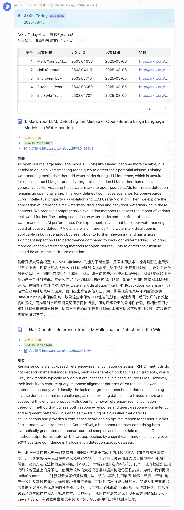
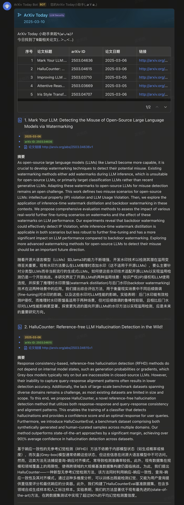

# ArXiv Today

<p align="center">
    <a href="README.md">
        
    </a>
    <a href="README-zh.md">
        
    </a>
    
</p>

> ArXiv Today：通过飞书（Lark）机器人，每日获取 arXiv 上的最新论文。

**ArXivToday-Lark** 是一个轻量级工具，可以自动从 [arXiv](https://arxiv.org) 获取最新论文，并通过自定义机器人直接推送到您的 [飞书](https://www.feishu.cn) 群聊中。该项目专为科研爱好者和学术专业人士设计，通过可定制的功能、无缝的集成以及可扩展的特性，简化了每日论文的获取过程。

主要特点包括：
- **自动化调度**：支持 crontab 和 schedule 库的定时执行
- **基于 LLM 的论文筛选**：使用 AI 模型根据自定义研究兴趣智能筛选论文
- **摘要翻译**：使用 LLM 自动将英文摘要翻译为中文
- **灵活配置**：支持多个 arXiv 分类、关键词过滤和自定义标签
- **OpenAI SDK 兼容**：支持 Ollama、OpenAI 及其他兼容的 LLM 服务
- **丰富的消息卡片**：精美的飞书消息卡片，包含论文详情和链接

无论您是在探索前沿研究，还是为团队整理论文，**ArXivToday-Lark** 都能帮助您高效、轻松地保持更新。

## Demo





## 功能特性

- [x] **自动论文获取**：从多个 arXiv 分类检索最新论文
- [x] **基于 LLM 的论文筛选**：使用 AI 模型根据自定义研究兴趣智能筛选论文
- [x] **摘要翻译**：使用 LLM 自动将英文摘要翻译为中文
- [x] **关键词过滤**：通过预定义关键词过滤论文以提高关联性
- [x] **飞书集成**：向飞书群聊发送格式化的消息卡片
- [x] **灵活调度**：支持 crontab 和 Python schedule 库的自动化
- [x] **OpenAI SDK 兼容**：支持 Ollama、OpenAI 及其他兼容的 LLM 服务
- [x] **重复检测**：自动去除跨分类和历史运行的重复论文

## To Do

- [ ] LLM 预测论文影响力

  > Zhao P, Xing Q, Dou K, et al. From Words to Worth: Newborn Article Impact Prediction with LLM[J]. arXiv preprint arXiv:2408.03934, 2024.

## 使用方法

### 前置条件

1. 克隆此仓库。

   ```sh
   git clone https://github.com/InfinityUniverse0/ArXivToday-Lark.git
   ```

2. 创建并激活 conda 环境。

   ```sh
   conda create -n arxiv
   conda activate arxiv
   ```

3. 安装所需的 Python 包。

   ```sh
   cd ArXivToday-Lark
   pip install -r requirements.txt
   ```

## 项目结构

```
ArXivToday-Lark/
├── main.py                 # 主脚本入口
├── config.yaml            # 配置文件  
├── paper_to_hunt.md       # LLM 筛选提示模板
├── requirements.txt       # Python 依赖
├── ArXivToday.card        # 飞书消息卡片模板
├── arxiv_paper.py         # arXiv 论文获取和筛选
├── lark_post.py           # 飞书 webhook 发送功能
├── llm.py                 # LLM 集成工具
├── utils.py               # 配置和工具函数
└── images/                # 演示截图
    ├── demo.png
    └── demo-dark.png
```

### 部署

在 [飞书](https://www.feishu.cn) 中，将 **[自定义机器人](https://open.feishu.cn/document/client-docs/bot-v3/add-custom-bot)** 添加到群聊，部署并运行本项目，即可通过机器人每日自动获取 arXiv 最新相关论文并推送到群聊。

#### 添加飞书自定义机器人

参考 [这里](https://open.feishu.cn/document/client-docs/bot-v3/add-custom-bot) 的文档操作步骤，在飞书中添加群聊机器人。

#### 设置飞书消息卡片模板

参考 [这里](https://open.feishu.cn/document/uAjLw4CM/ukzMukzMukzM/feishu-cards/quick-start/send-message-cards-with-custom-bot) 的文档操作步骤，在飞书中设置消息卡片模板。

这里我提供了 [Demo](#Demo) 中用到的消息卡片模板，可以在飞书中直接导入 `ArXivToday.card` 并使用。

#### 配置脚本参数

在 `config.yaml` 中，将在前面的步骤中操作后得到的参数进行配置：

**基础配置：**
1. **飞书机器人 Webhook URL**
2. **飞书消息卡片模板的 ID 与版本号**  
3. **标签** - 用于在消息卡片中标识论文类别

**论文筛选配置：**
4. **arXiv 分类** - 要搜索的 arXiv 分类列表（如 `cs.CL`、`cs.AI`、`cs.LG`）
5. **关键词** - 用于基础筛选的关键词列表
6. **LLM 筛选** - 启用/禁用基于自定义研究兴趣的 AI 论文筛选

**LLM 服务配置（支持 Ollama 以及其他与 OpenAI SDK 兼容的模型）：**
7. **模型名称** - 如 `qwen2.5:7b`、`gpt-4o-mini`
8. **基础 URL** - API 端点（Ollama 示例：`http://localhost:11434/v1`）
9. **API 密钥** - 认证密钥（Ollama 可设置为任意非空字符串）

**高级选项：**
10. **翻译功能** - 启用/禁用自动摘要翻译为中文

#### 配置示例

```yaml
# 飞书机器人配置
webhook_url: 'https://open.feishu.cn/open-apis/bot/v2/hook/YOUR_WEBHOOK'
template_id: 'YOUR_TEMPLATE_ID'
template_version_name: '1.0.0'

# 论文配置  
tag: 'AI 安全研究'
category_list:
  - cs.CL  # 计算与语言
  - cs.AI  # 人工智能  
  - cs.CR  # 密码学与安全
  - cs.LG  # 机器学习

keyword_list:
  - security
  - safety
  - adversarial
  - alignment

# LLM 配置（Ollama 示例）
model: 'qwen2.5:7b'
base_url: 'http://localhost:11434/v1' 
api_key: 'ollama'
use_llm_for_filtering: true
use_llm_for_translation: true
```

若要使用基于 LLM 的筛选功能，请在 `paper_to_hunt.md` 中自定义研究兴趣，以描述您要寻找的论文类型。

按照你的实际情况进行修改。

#### 运行脚本

脚本将执行以下步骤：
1. 从配置的 arXiv 分类获取论文
2. 按关键词筛选（如果配置）
3. 应用基于 LLM 的筛选（如果启用）  
4. 将摘要翻译为中文（如果启用）
5. 去除与之前运行的重复论文
6. 向飞书群聊发送格式化卡片

使用 Python 运行 `main.py` 即可运行该脚本。

```sh
python main.py
```

**输出示例：**
```
Task: 2024-03-10
Total papers: 387
Deduplicated papers across categories: 275
Filtered papers by Keyword: 45
Filtered papers by LLM: 12
Deduplicated papers: 9
Translated Abstracts into Chinese
Request successful
```

但是为了让该脚本周期性地运行，你可以采用 Linux 系统的 `crontab` 命令，也可以使用 `schedule` 库来定期运行任务。

##### 使用 crontab 命令周期性运行

> 需要 Linux 系统

例如，若要在每个工作日（weekday）的12:24（24小时制）查询 arXiv 论文并通过飞书机器人推送，可以：

1. 使用如下命令打开 `crontab` 编辑器

    ```sh
    crontab -e
    ```

2. 添加如下内容并保存

    ```sh
    24 12 * * 1-5 /absolute/path/to/your/python/interpreter /absolute/path/to/ArXivToday-Lark/main.py
    ```

> [!NOTE]
>
> ⚠️ 注意，这里需要填写**绝对路径**

3. 可以通过如下命令检查 `cron` 任务是否正确设置

    ```sh
    crontab -l
    ```

##### 使用 schedule 库周期性运行

1. 安装依赖

   ```sh
   pip install schedule
   ```

2. 将 `main.py` 中的如下注释部分取消注释，并按照实际需求进行修改

    ```python
    ### Uncomment the following code to use `schedule` to run the task periodically ###
    import time
    import schedule
    # Schedule the task to run every day at 10:17
    schedule.every().day.at("10:17").do(task)  # TODO: Change the time for your own need
    while True:
        schedule.run_pending()
        time.sleep(1)
    ```

## 问题排查

### 常见问题

**LLM 服务连接问题：**
- 确保您的 LLM 服务（Ollama/OpenAI）正在运行且可访问
- 检查 `base_url` 配置是否与您的服务端点匹配
- 对于 Ollama，确保在主机 URL 后添加 `/v1`

**找不到论文：**  
- 验证 `category_list` 中的 arXiv 分类是否有效
- 检查关键词过滤是否过于严格
- 查看 `paper_to_hunt.md` 中的 LLM 筛选提示

**飞书机器人无响应：**
- 确认 webhook URL 正确且有效
- 确保消息卡片模板 ID 和版本配置正确
- 检查机器人是否有在群组中发送消息的权限

**权限错误：**
- 在 crontab 配置中使用绝对路径
- 确保 Python 解释器和脚本路径正确

### 调试模式

要调试问题，您可以运行单个组件：

```bash
# 测试配置加载
python -c "from utils import load_config; print(load_config())"

# 测试论文获取（不使用 LLM）
python -c "from arxiv_paper import get_latest_papers; papers = get_latest_papers('cs.AI', 5); print(f'Found {len(papers)} papers')"

# 测试 LLM 连接  
python -c "from utils import get_llm_response, load_config; config = load_config(); print(get_llm_response('Hello', config))"
```

## 自定义扩展

可以在本项目的基础上进行自定义扩展。比如：

- 你可以自行定义消息卡片的样式，或采用其他消息类型。
- 可以使用飞书的 [应用机器人](https://open.feishu.cn/document/client-docs/bot-v3/bot-overview)（可能需要一些权限等），以实现更复杂的工作流。

## 许可证

本项目基于 [GPL-3.0 许可证](LICENSE)。

## 联系方式

如有任何问题、建议或反馈，欢迎联系：

- **电子邮箱**: wtxInfinity@outlook.com
- **GitHub 问题反馈**: [问题页面](https://github.com/InfinityUniverse0/ArXivToday-Lark/issues)

欢迎贡献代码、报告问题或提出改进建议！

## 贡献者

- [@InfinityUniverse0](https://github.com/InfinityUniverse0)
    - **E-mail**: [wtxInfinity@outlook.com](mailto:wtxInfinity@outlook.com)
- [@lxmliu2002](https://github.com/lxmliu2002)
    - **E-mail**: [lxmliu2002@126.com](mailto:lxmliu2002@126.com)

<a href="https://github.com/InfinityUniverse0/ArXivToday-Lark/graphs/contributors">
    
</a>
