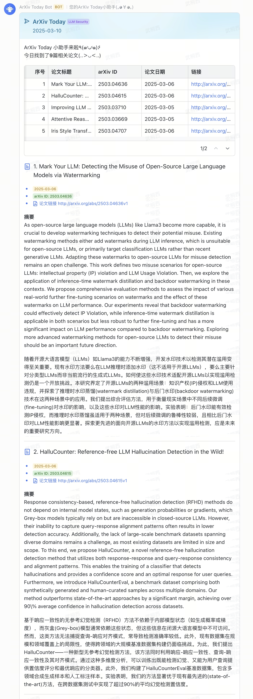

# ArXiv Today

<p align="center">
    <a href="README.md">
        
    </a>
    <a href="README-zh.md">
        
    </a>
    
</p>

> ArXiv Today：通过飞书（Lark）机器人，每日获取 arXiv 上的最新论文。

**ArXivToday-Lark** 是一个轻量级工具，可以自动从 [arXiv](https://arxiv.org) 获取最新论文，并通过自定义机器人直接推送到您的 [飞书](https://www.feishu.cn) 群聊中。该项目专为科研爱好者和学术专业人士设计，通过可定制的功能、无缝的集成以及可扩展的特性，简化了每日论文的获取过程。

其主要特点包括自动化调度、支持基于 LLM 的论文筛选、摘要翻译以及影响力预测（开发中）。无论您是在探索前沿研究，还是为团队整理论文，**ArXivToday-Lark** 都能帮助您高效、轻松地保持更新。

## Demo




## To Do

- [ ] 使用LLM进行更准确的论文筛选

- [x] 使用LLM翻译摘要

- [ ] LLM 预测论文影响力

  > Zhao P, Xing Q, Dou K, et al. From Words to Worth: Newborn Article Impact Prediction with LLM[J]. arXiv preprint arXiv:2408.03934, 2024.

## 使用方法

### 前置条件

1. 克隆此仓库。

   ```sh
   git clone https://github.com/InfinityUniverse0/ArXivToday-Lark.git
   ```

2. 创建并激活 conda 环境。

   ```sh
   conda create -n arxiv
   conda activate arxiv
   ```

3. 安装所需的 Python 包。

   ```sh
   cd ArXivToday-Lark
   pip install -r requirements.txt
   ```

### 部署

在 [飞书](https://www.feishu.cn) 中，将 **[自定义机器人](https://open.feishu.cn/document/client-docs/bot-v3/add-custom-bot)** 添加到群聊，部署并运行本项目，即可通过机器人每日自动获取 arXiv 最新相关论文并推送到群聊。

#### 添加飞书自定义机器人

参考 [这里](https://open.feishu.cn/document/client-docs/bot-v3/add-custom-bot) 的文档操作步骤，在飞书中添加群聊机器人。

#### 设置飞书消息卡片模板

参考 [这里](https://open.feishu.cn/document/uAjLw4CM/ukzMukzMukzM/feishu-cards/quick-start/send-message-cards-with-custom-bot) 的文档操作步骤，在飞书中设置消息卡片模板。

这里我提供了 [Demo](#Demo) 中用到的消息卡片模板，可以在飞书中直接导入 `ArXivToday.card` 并使用。

#### 配置脚本参数

在 `config.yaml` 中，将在前面的步骤中操作后得到的：

1. 飞书机器人 Webhook URL
2. 飞书消息卡片模板的 ID 与 版本号
3. LLM 模型的相关配置（支持 Ollama 以及其他与 OpenAI SDK 兼容的模型调用）
    - `model`
    - `base_url`: 若使用 Ollama，则该项为 `OLLAMA_HOST` URL 后面拼接 '/v1'
    - `api_key`: 若使用 Ollama，则该项可设置为任意非空字符串（Ollama 不进行鉴权）

按照你的实际情况进行修改。

#### 运行脚本

使用 Python 运行 `main.py` 即可运行该脚本。

```sh
python main.py
```

但是为了让该脚本周期性地运行，你可以采用 Linux 系统的 `crontab` 命令，也可以使用 `schedule` 库来定期运行任务。

##### 使用 crontab 命令周期性运行

> 需要 Linux 系统

例如，若要在每个工作日（weekday）的12:24（24小时制）查询 arXiv 论文并通过飞书机器人推送，可以：

1. 使用如下命令打开 `crontab` 编辑器

```sh
crontab -e
```

2. 添加如下内容并保存

```sh
24 14 * * 1-5 /absolute/path/to/your/python/interpreter /absolute/path/to/ArXivToday-Lark/main.py
```

> [!NOTE]
>
> ⚠️ 注意，这里需要填写**绝对路径**

3. 可以通过如下命令检查 `cron` 任务是否正确设置

```sh
crontab -l
```

##### 使用 schedule 库周期性运行

1. 安装依赖

   ```sh
   pip install schedule
   ```

2. 将 `main.py` 中的如下注释部分取消注释，并按照实际需求进行修改

    ```python
    ### Uncomment the following code to use `schedule` to run the task periodically ###
    import time
    import schedule
    # Schedule the task to run every day at 10:17
    schedule.every().day.at("10:17").do(task)  # TODO: Change the time for your own need
    while True:
        schedule.run_pending()
        time.sleep(1)
    ```

## 自定义扩展

可以在本项目的基础上进行自定义扩展。比如：

- 你可以自行定义消息卡片的样式，或采用其他消息类型。
- 可以使用飞书的 [应用机器人](https://open.feishu.cn/document/client-docs/bot-v3/bot-overview)（可能需要一些权限等），以实现更复杂的工作流。

## 许可证

本项目基于 [GPL-3.0 许可证](LICENSE)。

## 联系方式

如有任何问题、建议或反馈，欢迎联系：

- **电子邮箱**: wtxInfinity@outlook.com
- **GitHub 问题反馈**: [问题页面](https://github.com/InfinityUniverse0/ArXivToday-Lark/issues)

欢迎贡献代码、报告问题或提出改进建议！

## 贡献者

- [@InfinityUniverse0](https://github.com/InfinityUniverse0)
    - **E-mail**: [wtxInfinity@outlook.com](mailto:wtxInfinity@outlook.com)
- [@lxmliu2002](https://github.com/lxmliu2002)
    - **E-mail**: [lxmliu2002@126.com](mailto:lxmliu2002@126.com)

<a href="https://github.com/InfinityUniverse0/ArXivToday-Lark/graphs/contributors">
    
</a>
